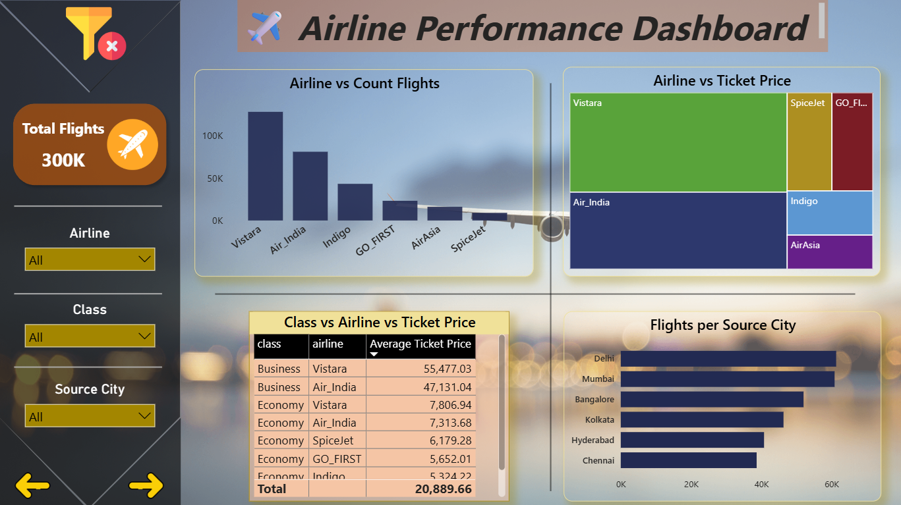

## ✈️ Skyline Analytics – Airline Business Insights (Power BI Dashboard)
### 📌 Overview

An interactive Power BI dashboard analyzing airline performance, revenue, and operations.
The project highlights profitable routes, pricing trends, and customer booking behavior to support data-driven decisions.

------------------------------------------------------------------------------------------
### 🎯 Key Objectives

Compare airlines by flights, ticket pricing, and routes.

Identify most profitable routes & cities.

Analyze timing trends (duration, stops, departure slots).

Study Business vs Economy class distribution.

--------------------------------------------------------------------------------------------
### 🔑 Key Insights

Indigo has the highest number of flights, while Vistara leads in pricing.

Mumbai → Delhi is the most profitable route.

Economy class makes up ~70% of bookings, but Business class contributes more revenue per ticket.

Night flights show higher demand from business travelers.

----------------------------------------------------------------------------------------------
### 🛠️ Tools

Power BI Desktop – Dashboarding

DAX – Custom measures (e.g., Most Profitable Route)

-----------------------------------------------------------------------------------------------
### 📸 Dashboard Preview

